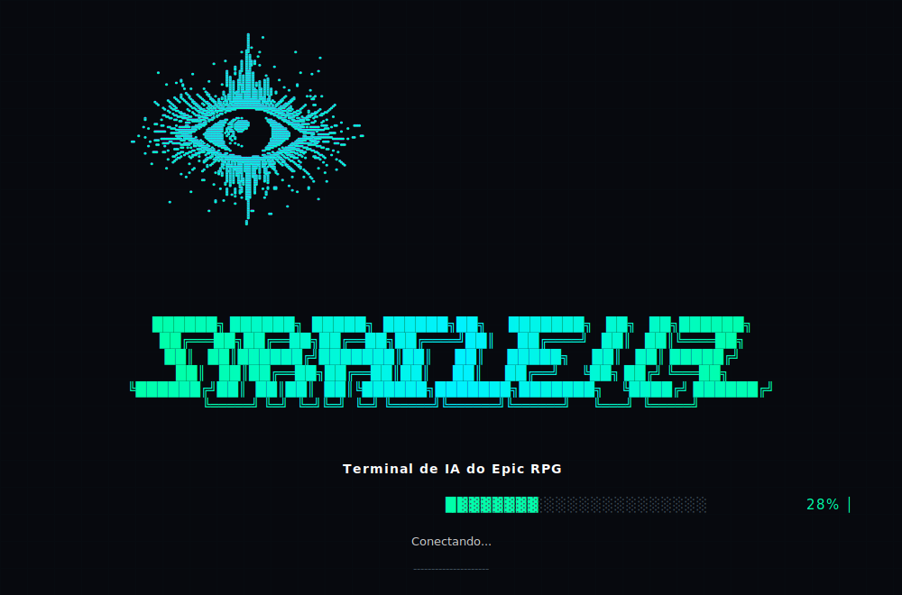
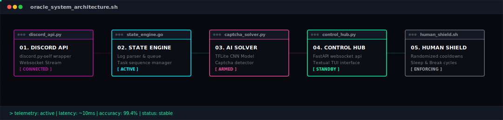

<!-- VISUAL MASCOT BANNER -->
<p align="center">
  
</p>


🇧🇷 **Para ler a documentação em Português, acesse: [README.pt-BR.md](docs/README.pt-BR.md).**


─────── ▪ ───────

## 📡 System Diagnostics

**Oracle v3** is a low-latency, state-machine driven automation companion built specifically for Epic RPG. Optimized for precise state loops, queue scheduling, and background security, it manages a humanized command pipeline. A local **TensorFlow Lite Convolutional Neural Network (CNN)** is utilized exclusively to solve verification guards and text captchas, keeping you fully updated via a terminal interface (**TUI**) and a browser-based **Control Dashboard**.

> [!NOTE]
> Navi Bot and Neon Util setup required for full features.

─────── ▪ ───────

## 🧠 System Architecture & Pipelines

The diagram below details the continuous execution pipeline, handling data transmission between Discord servers, our queue system, and local machine learning models:

<p align="center">
  
</p>

### Pipeline Execution Stages
1. **Ingest/Listen**: The Discord Gateway websocket captures guild messages using `discord.py-self`.
2. **Deconstruct/Parse**: Command parsers extract events, cooldown times, and prompt parameters.
3. **Lock Resolution**: Captchas trigger frame cropping and local processing using OpenCV, resolving symbols via the **TensorFlow Lite** model without relying on external APIs.
4. **Humanize**: Commands pass through a delay generator introducing random intervals, simulated typing typos, and scheduled coffee/sleep cycles.
5. **Expose/Telemetry**: Session analytics are piped to the Textual TUI and FastAPI websockets to feed remote clients.

─────── ▪ ───────

## ⚙️ Core Technical Specifications

```ini
[system-specification]
runtime      = Python 3.12 + Node.js v20
gateway_lib  = Discord.py-self v2.0 (Stealth Client)
ai_solver    = TensorFlow Lite 2.17 (Captcha CNN)
console_ui   = Textual TUI + Rich styling
web_backend  = FastAPI + Uvicorn + WebSockets
web_frontend = React 19 + Vite + Tailwind CSS v4 + Zustand
installers   = PyInstaller wrapper + Inno Setup package
```

| Component Module | Technologies | Operational Scope |
| :--- | :--- | :--- |
| **Automation Daemon** | Python, asyncio | Process loop management, profile configurations, enqueuing routines. |
| **AI Captcha Core** | TF Lite, OpenCV | Captcha detection, scaling, denoising, symbol classification. |
| **Textual Terminal** | Textual, TUI themes | High-speed telemetry, animated eye mascot, theme selector, inline shell. |
| **Telemetry Endpoint** | FastAPI, WebSockets | Exposes dashboard parameters, writes modifications to config storage files. |
| **Web Dashboard** | React 19, Zustand | Remote telemetry dashboard, settings tuning, custom terminal commands. |
| **Packaging Tools** | PyInstaller, Inno | Compilation of binary packages and system installers. |

─────── ▪ ───────

## 🚀 Deployment Pipeline

<details>
<summary><b>[1] Initialize Local Virtual Workspace</b></summary>
<br />

Isolate environment binaries and activate the console session:

```bash
# Create local virtual workspace:
python3 -m venv venv

# Activate (Linux/macOS):
source venv/bin/activate

# Activate (Windows CMD):
venv\Scripts\activate.bat
```
</details>

<details>
<summary><b>[2] Install Dependencies</b></summary>
<br />

Download execution libraries:

```bash
pip install --upgrade pip
pip install -r requirements.txt
```
</details>

<details>
<summary><b>[3] Setup Profile Credentials</b></summary>
<br />

Initialize the system configuration parameters by copying the sample template:

```bash
cp options_example.ini options.ini
```

Open `options.ini` and provide your parameters:
```ini
language=en
user_token=your_discord_account_token_here
channel_id=target_discord_channel_id
guild_id=target_discord_server_id
do_hunt=true
do_adv=true
```
</details>

<details>
<summary><b>[4] Boot Oracle Console (TUI Mode)</b></summary>
<br />

Fire up the dynamic terminal monitor:

```bash
python main.py
```
</details>

<details>
<summary><b>[5] Deploy Dashboard Web Controller</b></summary>
<br />

Host the FastAPI server and browse local statistics:

```bash
python launch_dashboard.py
```
*Browse stats locally or connect remote dashboards to the listening websocket.*
</details>

<details>
<summary><b>[6] Build Standalone Executables</b></summary>
<br />

Compile assets and bundle Python files into single binaries:

```bash
# Compile React Dashboard Bundle:
cd dashboard
npm install
npm run build
cd ..

# Build Portable EXE:
python build_windows.py
```
</details>

<details>
<summary><b>[7] Register Global Terminal Command (Linux)</b></summary>
<br />

Install local CLI wrappers:

```bash
chmod +x setup.sh && ./setup.sh
source ~/.bashrc
```
Launch the bot from any folder at any time by typing:
```bash
oracle
```
</details>

─────── ▪ ───────

## 📂 Repository Layout

```path
Oracle-V2/
├── bot/                # Python daemon, handlers, TUI core
│   ├── tui.py          # Main Textual application
│   ├── tui_eye.py      # Core animated eye and cat mascots
│   └── tui_splash_art.py # Giant Braille splash art definitions
├── dashboard/          # React Web Dashboard (Vite, CSS)
├── docs/               # Technical graphics, charts, localization
│   ├── banner.svg      # Pure visual cybernetic eye banner
│   └── architecture.svg # Pipeline schematic
├── options_example.ini # Reference config template
├── requirements.txt    # Application requirements
├── main.py             # App entrypoint
├── launch_dashboard.py # Backend launcher
└── setup.sh            # Global CLI installation script
```

─────── ▪ ───────

## ⌨️ CLI & Discord Commands

Control execution via the TUI console interface, web browser shell, or administrative Discord messages:

```text
  COMMAND             DESCRIPTION
  -----------------------------------------------------------------------------
  help                Displays shortcuts, command palettes, and manual modals.
  start / resume      Wakes up automation tasks and resumes queue listeners.
  pause / stop        Suspends commands and enqueuing threads.
  reset               Flushes state maps, command history, and queue tasks.
  stats [range]       Returns telemetry records (e.g. stats 1h, stats 45m).
  queue               Displays enqueued priority events.
  say <msg>           Sends a custom string to the configured Discord channel.
  tc start [c] [m]    Initiates Time Cookie mode (e.g. tc start 5c 60m).
  tc stop             Aborts current Time Cookie sessions.
  g start             Launches Fibonacci gambling sequence.
  g pause             Stops gambling routines.
  sleepet start       Switches execution focus to Pet Adventures.
  sleepet stop        Disables Pet Adventure loops and resumes default queue.
  theme               Loads the TUI styling palette overlay.
  exit                Gracefully shuts down services and saves logs.
```

### Discord Remote Admin Commands (`sb ` prefix)
Authorized administrator accounts can send control commands directly in the bot's configured channel:

* `sb help` / `sb ajuda`: Displays administrative commands help.
* `sb status`: Sends a live-updating session status message to Discord & Telegram (auto-updates every 30s).
* `sb config`: Displays the interactive configuration editor and current values.
* `sb config <param> <value>`: Updates a setting dynamically (e.g. `sb config typo_chance 0.08`).
* `sb toggle <param>`: Quickly toggles a boolean configuration option (e.g. `sb toggle hunt`, `sb toggle delay`).
* `sb log`: Uploads the current session log file directly to the chat.
* `sb export [txt/ini]`: Exports current configuration settings as a file.
* `sb pause` / `sb stop`: Suspends bot automation task loops.
* `sb start` / `sb resume`: Resumes execution loops.
* `sb reset`: Flushes execution queues, cooldown timers, and resets state maps.
* `sb sleepet start` / `sb sleepet stop`: Starts or stops sleepet mode (dedicated Pet Adventure automation).
* `sb tc start [c] [m]`: Initiates Time Cookie mode (e.g., `sb tc start 5c 60m`).
* `sb tc stop` / `sb tc pause`: Disables Time Cookie mode.
* `sb g start` / `sb g stop` / `sb g pause`: Starts or stops the Fibonacci gambling sequence.
* `sb say <message>`: Sends a custom string to the active channel.

─────── ▪ ───────

## 🛡️ Operational Stealth & Safety Protocols

```text
  [!] USE A RESIDENTIAL CONNECTION: Avoid cloud providers (AWS, GCP, Hetzner).
  [!] TYPING TYPOS ENFORCED: Emulates human writing quirks (typo_chance=0.05).
  [!] AUTOMATED COFFEE BREAKS: Random breaks (5-15 mins) occur every 1.5h.
  [!] SLEEP DEEP SESSIONS: Sets nightly offline periods (sleep_at, wake_up_at).
  [!] TELEGRAM NOTIFIER: Sends captcha errors to remote handlers instantly.
```

─────── ▪ ───────

## ⚠️ Legal Warning

```text
  [WARNING]
  This application interacts with Discord using custom client APIs. This action 
  violates the Discord Terms of Service. This package is built exclusively for 
  educational, scientific, and testing purposes. The authors accept no 
  liability for account suspensions or bans. Use at your own risk.
```

─────── ▪ ───────

## 📄 Licensing

Licensed under the terms of the **[MIT License](LICENSE)**. Open to modification, research, and redistribution. 

```text
  Copyright (c) 2026 Oracle Devs
  Permission is hereby granted, free of charge, to any person obtaining a copy
  of this software and associated documentation files...
```
